# Corpus Analysis Comparisons and Reflection

For DIGIT 100's Corpus Analysis assignment, I decided to compare Alice in Wonderland by Lewis Carrol and The Wizard of Oz by L. Frank Baum using Voyant Tools and Antconc. I chose these two childrens' novels because 1. Nostalgia and 2. The shapes of their stories bear some
similarities, and I thought it might be neat to see if you could use Voyant to spot the most frequent characters, and Antconc to map
their chonological appearances in the concordance plot.

I had to do some clean-up of both of the text files in oXygen so that all the irrelevant garbeldegook wouldn't make my word frequency comparisons all wonky. I decided to run each file through Voyant first, since I think Voyant makes the data super easy to read (and it just straight-up looks prettier than Antconc!). 

### Voyant Data Comparison
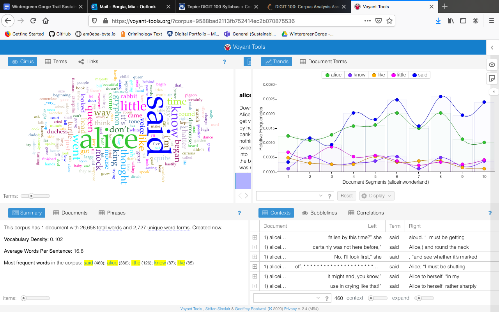
*Alice in Wonderland*
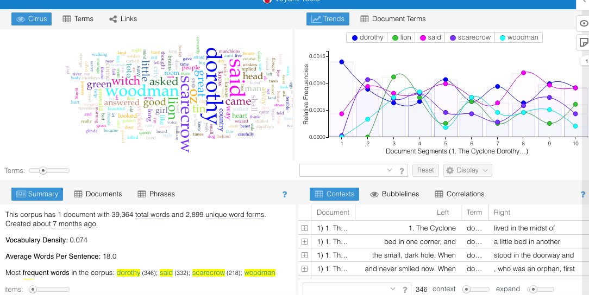
*Wizard of Oz*

### Voyant Word Cloud Comparison
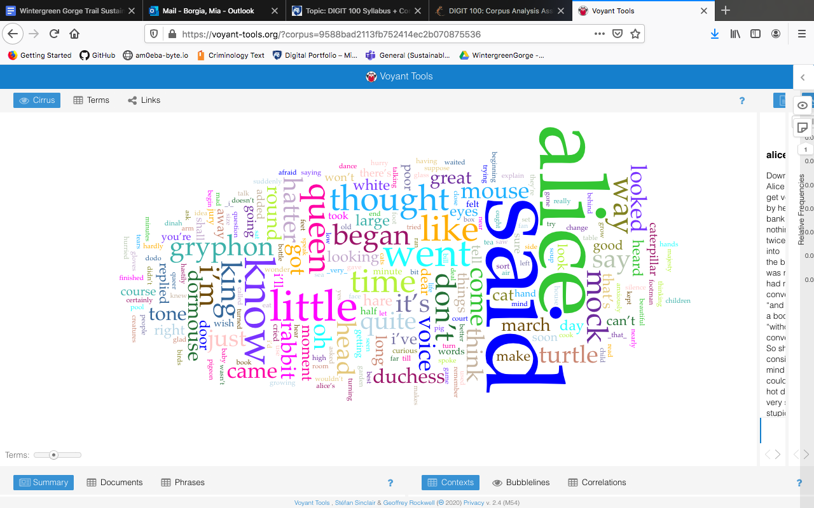
*Alice in Wonderland*
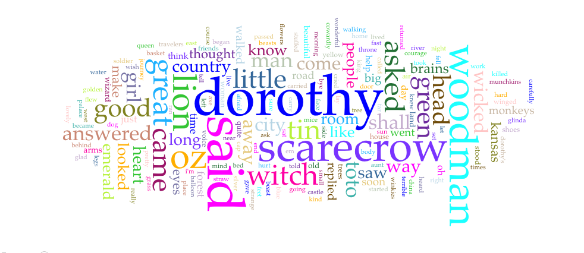
*Wizard of Oz*

In observing the data and word clouds that Voyant fabricated out of each of the texts, immediately there's an obvious pattern:
the female lead character's name, and "said". This is not surprising, as both novels frequently refer to their lead characters as they
go about their journey, and both novels have a lot of dialogue between characters. 

A bit surprisingly though, the frequency rank of those two words differ between the
texts; "said" occurs a bit more frequently than "alice," while the use of "said" is a bit less frequent than "dorothy". This could be for
two reasons, I'd guess: 1. In *Alice in Wonderland*, it was more common for dialogue to be used than reference to Alice, and 2. Both the
narrator and the characters in *The Wizard of Oz* said "Dorothy!" a whole lot more often than those in *Alice in Wonderland*, so the use
of "said" comes in a close second. 

I also noticed that the secondary main characters' names appear to be much more frequent in proportion to the lead character's name in
*The Wizard of Oz,* while Alice's creature friends' names appear much less frequent. You can see, "scarecrow" and "woodman" come in close
third in word size within the *Oz* cloud, whilst "gryphon," "dormouse," and "hatter" are significantly less frequent in the *Wonderland*
cloud. I'm guessing this is due to the fact that Dorothy's yellow brick road companions stuck with her in the storyline from the time
they were introduced until she wakes from her dream - Alice's companions tended to pop in and out occasionally throughout her Wonderland
adventure. 

### Antconc N-Gram Comparison

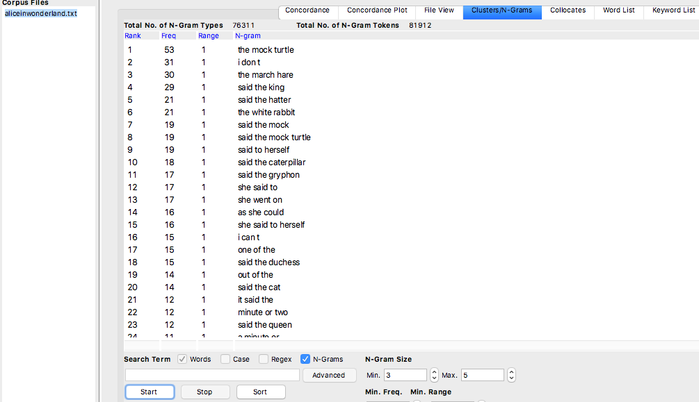

*Alice in Wonderland*

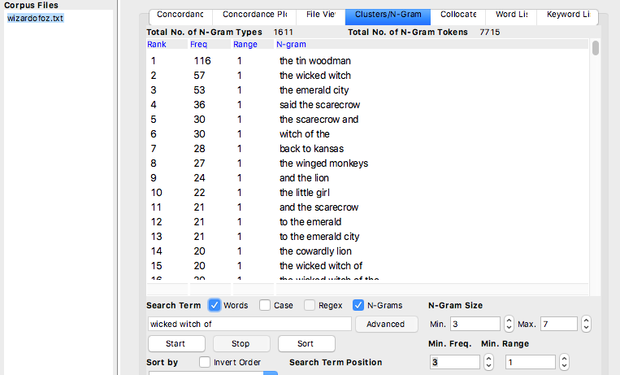

*Wizard of Oz*

Surprisingly, both of these 3-gram data sets do not feature a single use of the female lead characters' names - instead, both show a very
high frequency of secondary recurring character dialogue. 

In Alice in Wonderland, there was one major creative difference I could spot by comparing both the Antconc N-Grams and the Voyant Clouds
of Carrol's and Baum's novels: Carrol tended to include Alice's internal dialogue and personal thoughts a whole lot more frequently than
Baum included Dorothy's internal dialogue. I could see this because the word "thought" is quite large and thus frequent in the *Wonderland* Voyant cloud, and also the term "she said to herself" is quite high on the frequency ranking list in the 3-gram data - whereas I couldn't find much evidence of Dorothy's thought processes in either of the *Oz*'s data collections.

I could also tell by looking at the novels' 3-gram clusters that *The Wizard of Oz* puts a lot more emphasis on the story's antagonist
than *Alice in Wonderland*. You can see that "the wicked witch" is the 2nd most frequent 3-gram cluster, while the most frequent terms referring to the evil Queen in *Wonderland* only occurs 12 times, and it is far less frequent than some other terms. 

I also used Antconc's Concordance Plot tab to find some interesting storyline comparisons between the two novels:

### Antconc Concordance Plot Comparisons
The two most common clusters of both stories had something to do with secondary characters that interacted with the lead characters along
their journeys; "the Tin Woodman" and "the Mock Turtle."
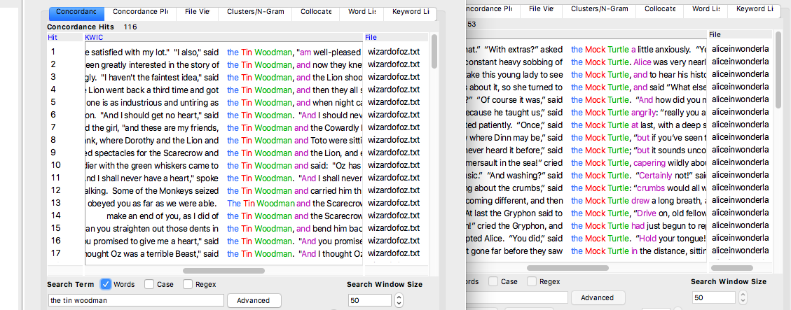

Here are those clusters concordance plots:
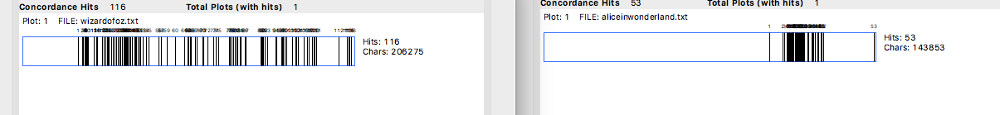

Very interestingly, the appearance of "the Tin Woodman" appears much more evenly and scattered throughout the whole story of *Oz* as opposed to the interactions with "The Mock Turtle" - The Mock Turtle seems to interact with Alice and her story in a shorter period of time within the story compared to the Tin Woodman, but in the time that the Turtle interacts with Alice, apparantly they're talking to/about each other a lot! These Concordance Plot comparisons showed very interesting differences in secondary character referencing, showing how similar yet subtly different these two stories are built.

An even more interesting Concordance Plot to compare was that of the Antagonists' names:
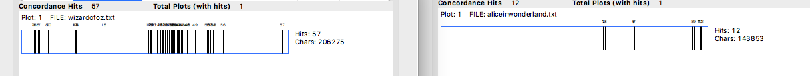
RIGHT SIDE: **wicked witch** LEFT SIDE: **the Queen**

-
- 
-
-
-
-
-
-
-
-
-
-
-
-
-
-
-
-
-
-
-
-
-
-
-
-
-

### My Annotations' Voyant Word Cloud and Data

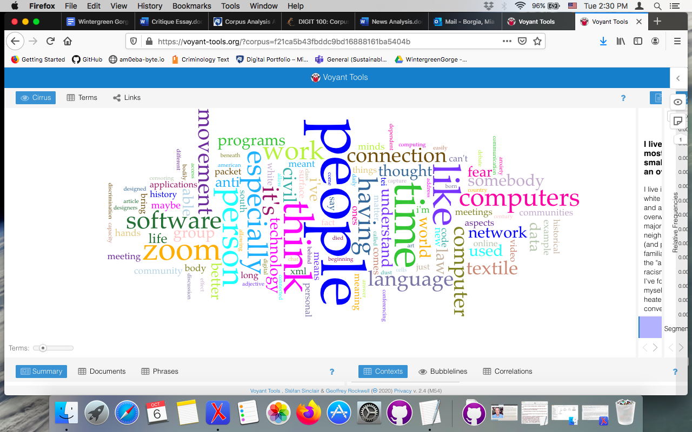

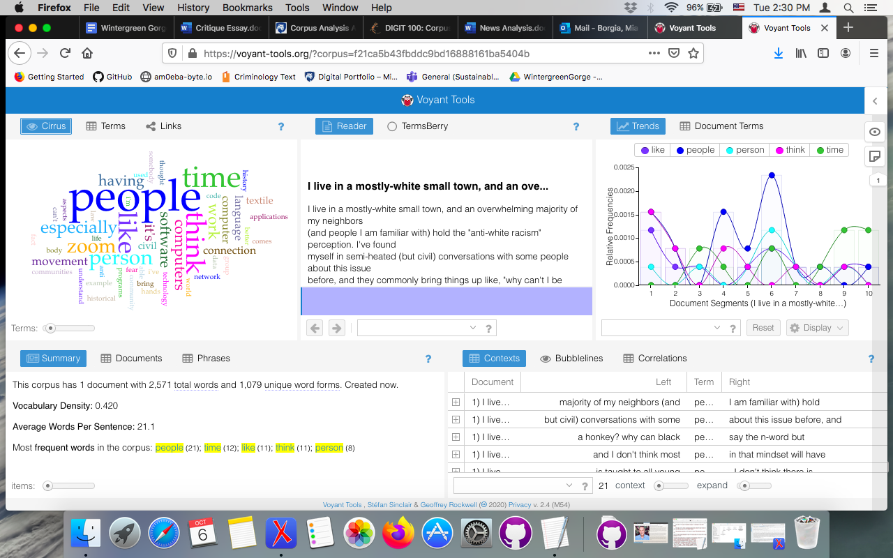

### The Whole Class's Annotations Word Cloud and Data

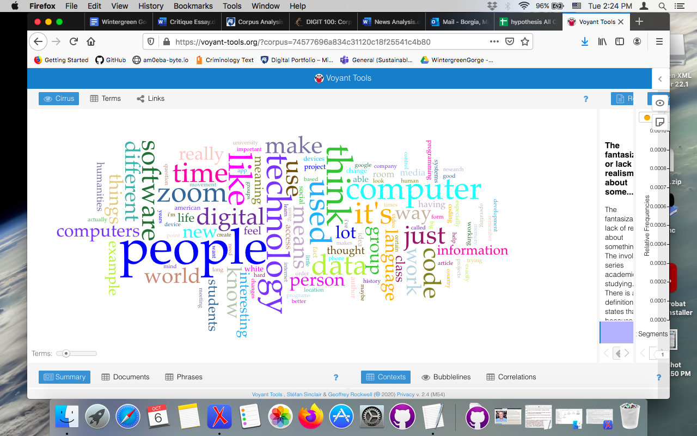

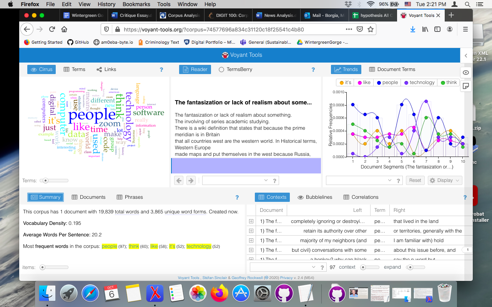

The first thing that stands out straight away with these word clouds is the fact that both my own and the whole class's tendency was to use the word 
"people" a whole lot! It comes up as the most frequently used with both text sets, with my frequency count at 21 and the class's at 97. So actually,
since my annotations are included in the whole class's, my frequent use of the word "people" certainly contributed in a large part to the overall
class's frequency. Another word-frequency similarity pops out in the size of the word "think" in both word clouds. I used it 11 times in my annotations,
and the whole class used it 60 times. As you'll notice in the Antconc analysis, that high frequency of the word "think" is probably 
within the terms "I think" or "I don't think," which is likely a result of both my and the class's affinity for including personal opinions or 
thought processes in our annotations - which is good, because that means at least some of the articles got us thinking and wanting to express it! One
more similar big-word in both Voyant word clouds was the word "like" - and I'm guessing that was because of our tendency to compare things in the 
articles with something else we thought of, or trying to describe some information in the article with a simile. 

A big difference in these word clouds was the use of the word "time." It seems I used that word far more frequently than the class did, proportionally
speaking. That might be because I definitely annotated a whole lot on Warsame's "The Vast Conspiracy of Memory," which references time and moments
a lot. Likewise, the word "technology" appears more frequently in the whole class's annotations than mine - I couldn't give you a solid reason for that,
but if I had to guess, maybe it's because the rest of the class tended to annotate things that were related to technology somehow more often than I did.

### My Annotations' Antconc N-Grams

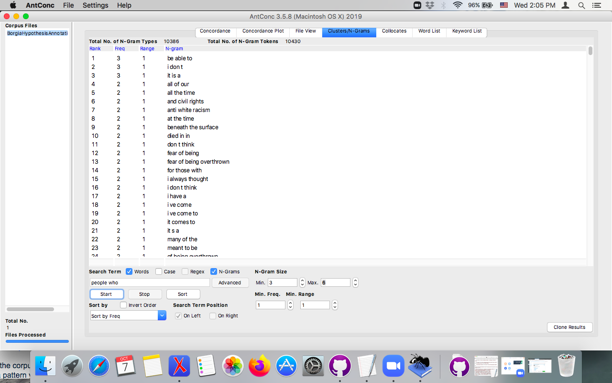

### The Class's Antconc N-Grams

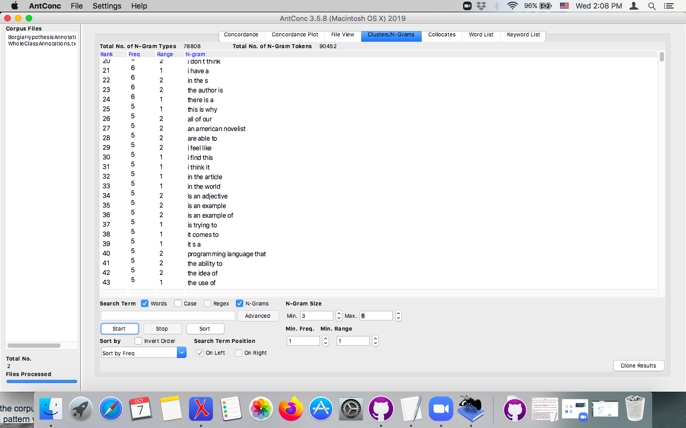

In the Antconc program, I found some similarities between the two sets of annotations in term usage within the n-grams that very highly correlate
with my findings from the Voyant clouds. One of the most frequent terms included people; "people who" was found 8 times in my annotations, and the term
"people who are" was found in the class's annotations 7 times - mine being one of them. This showed that the class had a tendency to place "are" after
"people who" much more than I did - while I tended to use a variety of different verbs aside from "are." This reflects the gigantic "people" that occurred
within both mine and the class's Voyant word cloud. I also noticed using KWIC that those phrases tended to be used in a number of different articles, so 
our use of phrases to describe people were pretty universal throughout the subjects we were annotating on. 

Another frequent n-gram included the word "think": I used "I think" 5 times, and the class used "I think that" 9 times, and "I don't think" 4 times, 
excluding my own use. Again, this is very reflective of the Word Clouds; and my hypothesis was proven correct *ba dum tss*, phrases containing
"think" were indeed used in a variety of contexts to supplement our annotations with our conjectures on certain bits of information in the articles.

One of the few differences between my N-Grams and the class's was that, apparantly, I like to talk about fear. The term "fear of" occurred in my 
annotations 4 times, and they tended to be within contexts relating to humanity or anxieties. The class, on the other hand, had a much higher frequency
(proportionally speaking) of the phrases "an example of," "the fact that," and "a lot of." These were used primarily to emphasize some aspect of the
information they were annotating, or providing thorough explanations of objects within the texts. I seemed to use those phrases a lot less than the class.

One last thing I found intriguing that may be good to point out was the frequency of the n-gram "anti-white racism" which appeared in the whole class's
annotations on Antconc. I used the term twice, and the rest of the class used it 6 times, for a total of 8. This was no doubt in relation to the article
we read which defended Khalid Warsame against a British professor's offensive response to "The Vast Conspiracy of Memory" in Humanist. That article
must've really got the class going, as proven in the n-gram frequency!
