# Frankenstein Variorum Review

This page is a review/critique of the [Digital Frankenstein Variorum](https://frankensteinvariorum.github.io/viewer/), which collects editions of Mary Shelley's novel Frankenstein and compares moments of change between each edition for users to experience.

### Interesting Discovery Moments

Reading the 10 sections using the 1818 edition of Frankenstein as the default, I found it fascinating and extremely 
curious how Mary Shelley changed entire narratives of characters between this edition and the 1831 & Thomas editions. 
There is one such passage in section 6 that, in the 1818 version, is comprised of only 3 sentences. In that small passage, 
Victor writes to his sister of how the stranger he had rescued from the arctic began talking to him about his endeavors. 
All that Mary Shelley includes is that the stranger gives Victor good advice, and Victor perceives him as a very amicable and compassionate person. 
Meanwhile, in the 1831 edition, this brief description of the characters’ budding connection is super-imposed into four entire lengthy paragraphs, 
containing new dialogue and a much deeper read into the stranger’s character, his woes, and his deep connection & sympathies with Victor. This lengthy and revealing expansion
of the passage from the 1818 and 1823 editions in the 1831 edition adds a whole new layer of intrigue and mystery onto readers’ perspective of the stranger.

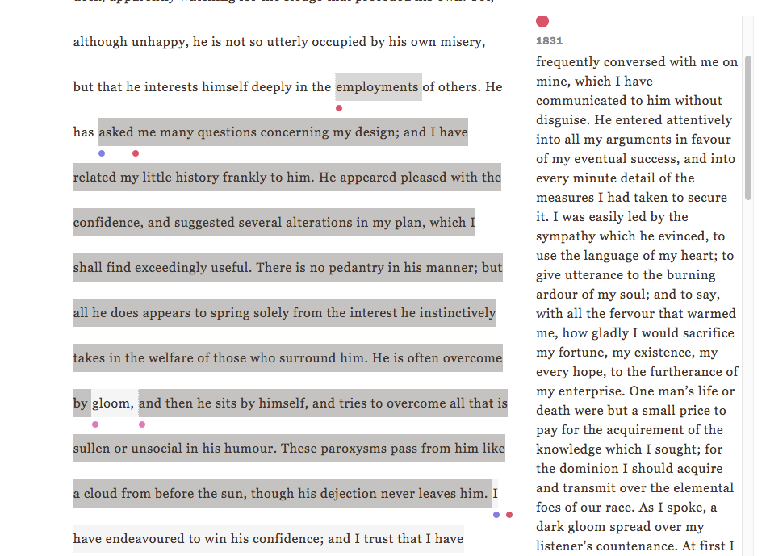

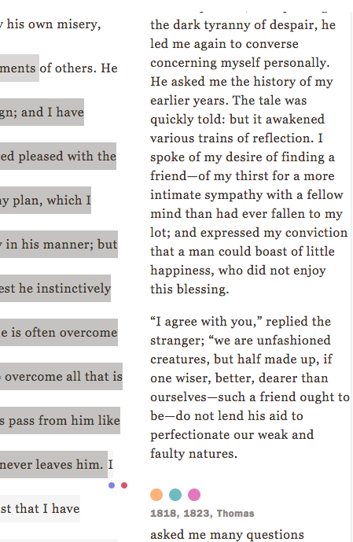

There were so many other interesting differences between the Thomas edition and the others, but this one from the 1831 edition was undeniably significant: 
in section 7, before the 6th paragraph in the 1818 edition (beginning with “When my father became a husband and a parent...”), Mary Shelley inserted an extremely 
thorough background narrative to Victor’s parents, how they met and fell in love, their tender and loving parenting throughout Victor’s childhood, and the story of how 
his parents found his sister Elizabeth and adopted her from a poor family in Italy – all in the 1831 edition. Omitting that whole background, I suppose you still gather 
the understanding of the narrator’s deep love he has for his parents and his sister in the editions before 1831, but by adding this touching background into Victor’s parents’ 
and sister’s pasts, Mary Shelley paints a much more vivid picture of the connections between these characters, and adds a more powerful bond between reader and character, 
allowing readers to envision these characters and their pasts in much deeper detail – like she did with the passage I mentioned above with the stranger on the boat.

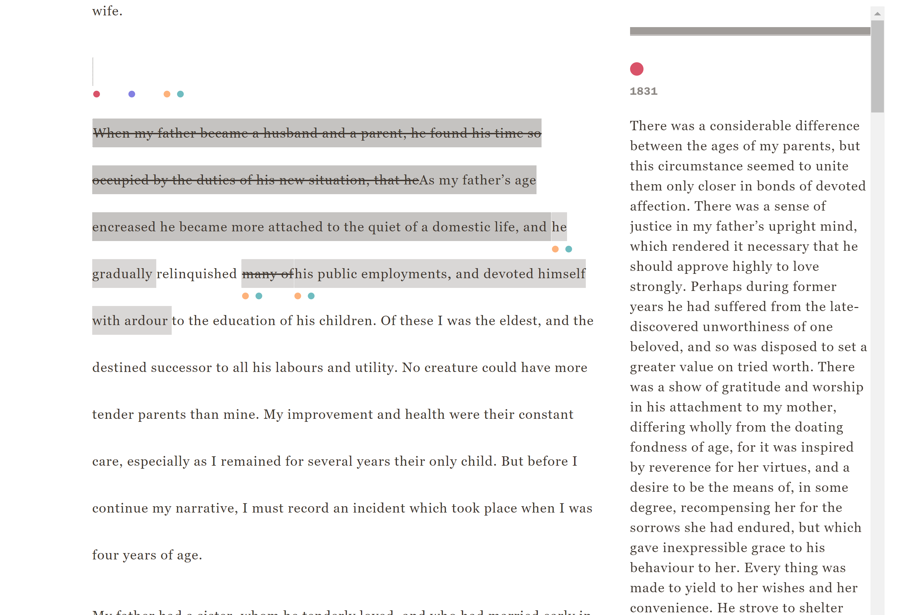

There are some smaller yet still interesting changes that change the tone and the way information is perceived by the reader – one being a passage in section 3 where Robert 
is writing to his sister about a seaman on board with him, who once tried to convince his ex’s father to let her be with her desired lover instead. Robert tells his sister 
in the letter that while the man’s actions were noble, he isn’t educated much, and doesn’t have many inclinations beyond being a sailor. In the 1818, 1823, and Thomas editions, 
all that is written is that he “doesn’t have much of an idea beyond the rope and shroud,” while in the 1831 edition, he writes instead that he is “wholly uneducated,” and his air 
of ignorant carelessness sort of detracts from his capacity to be fully sympathized with. This change, while somewhat minor, totally changes the way the reader perceives Robert’s 
perception of the sailor. The 1831 edition sort of reflects a different attitude towards the sailor within Robert, while the other editions seem to mention the fact of his lack 
of education in mere passing. The tone of this detail shifts quite a bit between the two versions – and I’ve noticed many other instances where different editions reflect minor 
tone changes like this as well.

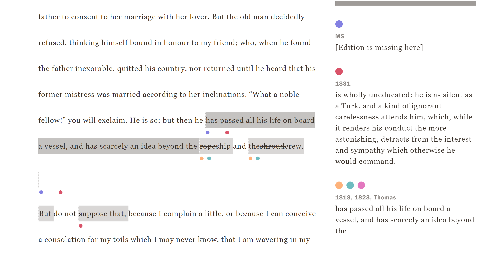

It seems, from the Thomas Copy edition to the 1831 edition, many of the strike-throughs, insertions, deletions, and substitutions that Mary Shelley made by hand 
in the Thomas copy were reflected almost exactly as corrections in her 1831 edition. You can especially see evidence of this in section 7, where in all of the other 
editions the passage in the screenshot below is included in some form – in the Thomas copy, she crossed the whole thing out – and then in the 1831 edition, the passage 
she struck through has been omitted.

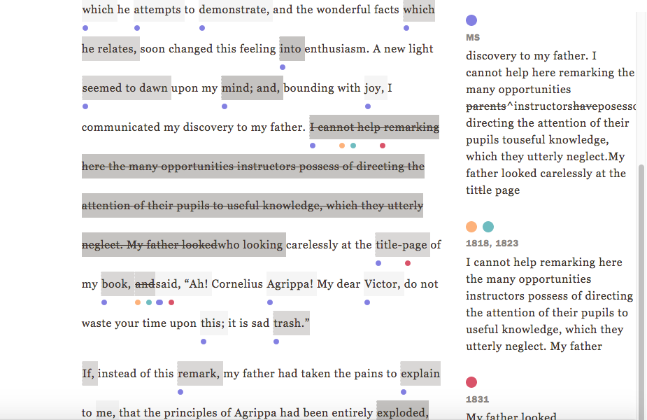

### User Experience Review

For starters, the overall layout and design of the Frankenstein Variorum website is very clean, simple, and easy to navigate. I personally find the aesthetic of the website's design very appealing and easy on the eyes. The only aspect of the design that could be touched up to increase readability is the color numbered circles behind the Choose Version, Choose Section, and Choose Options menus at the top of the variorum viewer. The very light tan color doesn't have enough contrast against the white background, making it a bit difficult to see the numbers inside the circles. If the color of those circles was changed to be a bit darker, that could be easily fixed. 

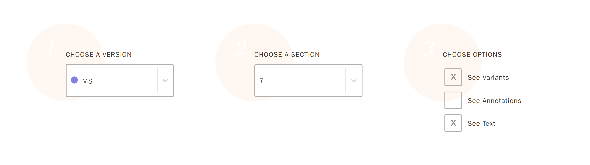

There are also some areas of an indication of change like the one pictured below, where it is unclear to the user what the small dotted gray line is meant to indicate. Here, the two dots representing a change in the 1832 and the MS edition is a line above the supposed area of variation, which is quite dark, but not much variation seems to happen there. Does this mean that "Shall" is a line above the rest of the passage in the other editions here? There are a few areas where this happens.

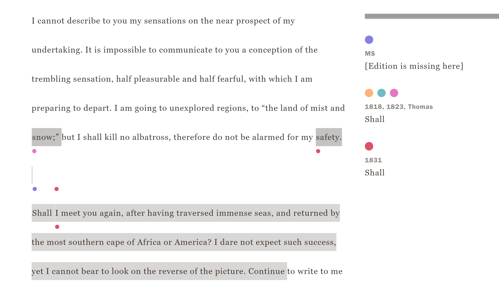

This same passage also has an example of some potentially unnecessary highlighting. It seems, the entire beginning of the passage is highlighted quite darkly, but upon further investigation it appears only one small area actually has some minor variation occurring. The passage is identical in all variations up until the beginning of the last sentence that is highlighted - "Continue..." in all variations except 1831, and "Continue for the present..." in 1831. Overhighlighting areas like this might confuse users, and it causes some misguided comparisons between the variations for users to experience.

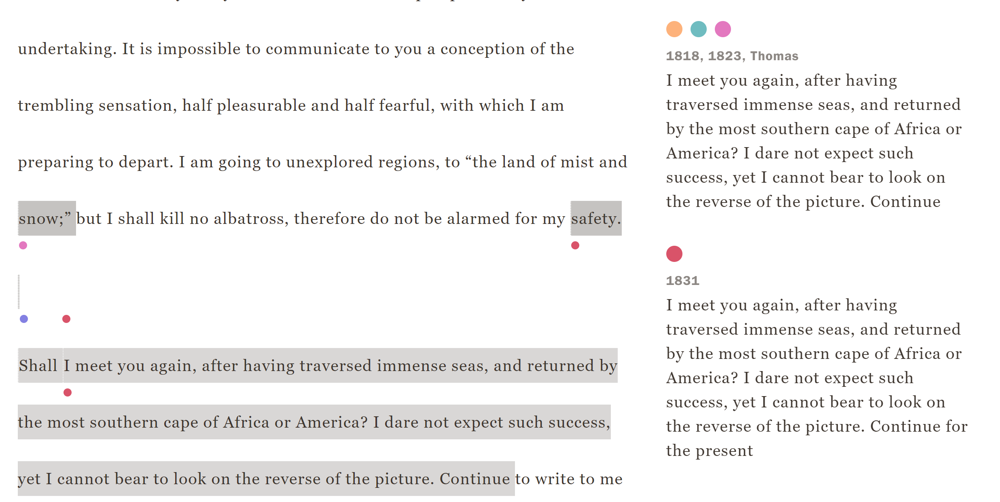

There are also some somewhat important areas where I think it could be made more clear where the chapter numbers vary in the sections. In areas like the one below from section 9, the two separate annotation blocks could be coalesced into one I think - as it is right now, the expression of the variation in how Mary Shelley numbered the chapters is a bit vague because of how the highlighted sections are separated.

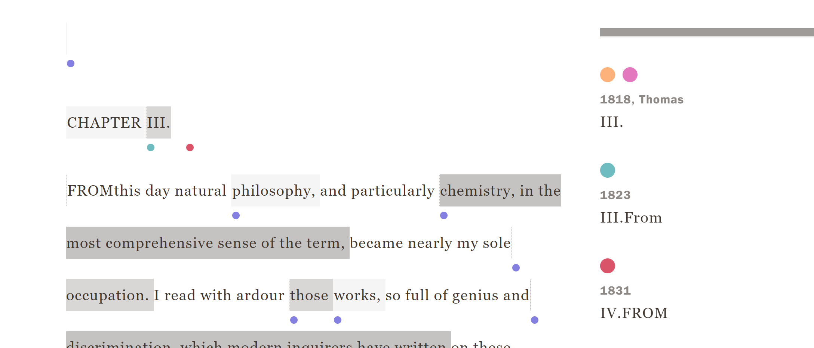

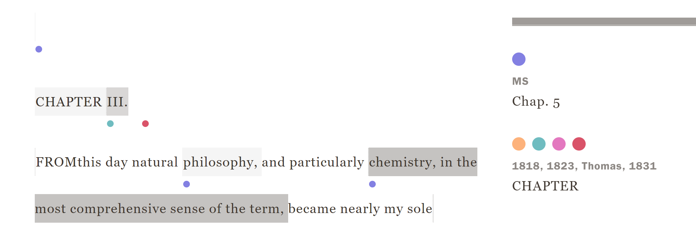

There are also quite a few areas where the ending of the highlighted portion of text and the endpoint of the corresponding variation annotations don't match up, making it difficult to decipher where the variation points end and connect with the areas that have no change. Some examples:

In the screenshot below from 1818 edition section 9, according to the MS variation annotation, the passage would read like this: 
"...and particularly cularly chemistry became ^nearly  my sole ~~appli~~ became nearly my sole..." 
The crossed out section becomes more clear in the annotations around "occupation," but at first this could confuse users. It makes for a not-so-smooth UX.

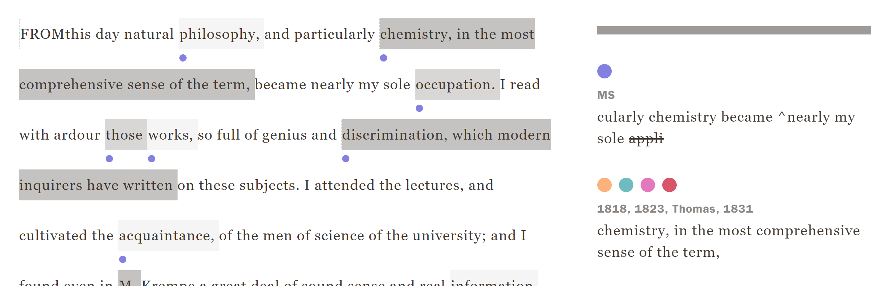

In the next screenshot, from the same edition and section, according to the MS variation annotation, the passage would read: 
"... so full of genius and so full of genius and discrimination ~~that have been written~~ on these sub- on these subjects."
Again, it's just a bit messy, and may confuse users.

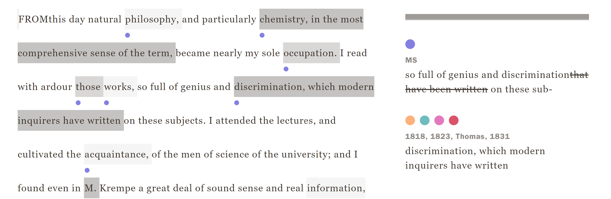

Although many aspects of the highlighting and variorum annotation comparisons need some work, overall I think this is a wonderful start - the website is easy to navigate, and most of the annotations and highlights seem accurate and expose very interesting comparisons for the user to read and digest!
