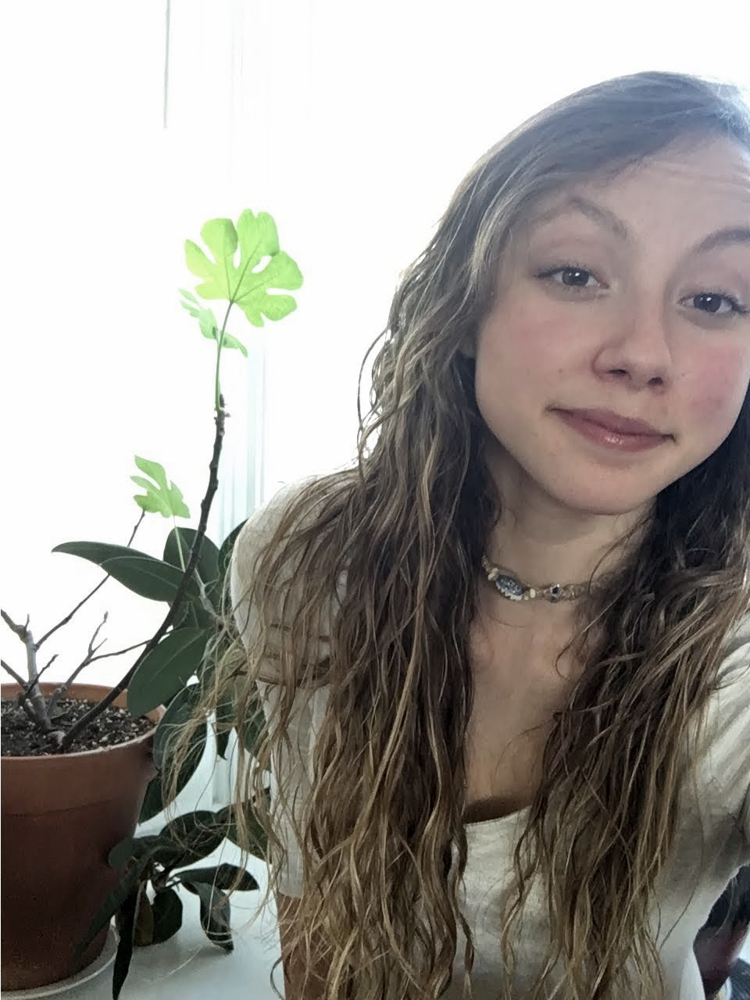
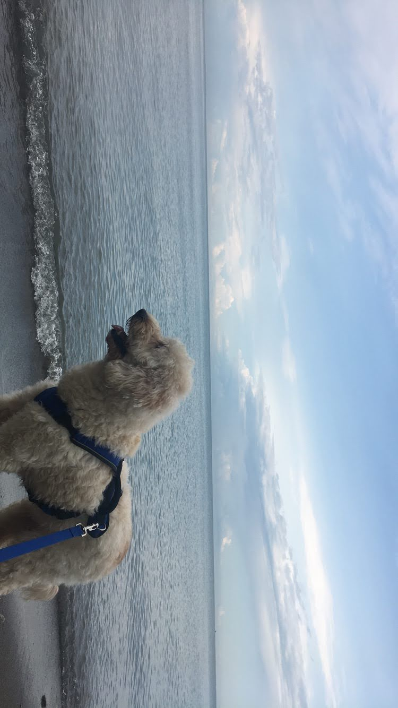
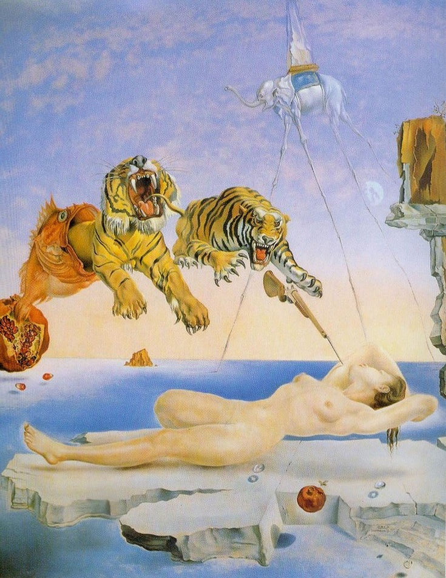
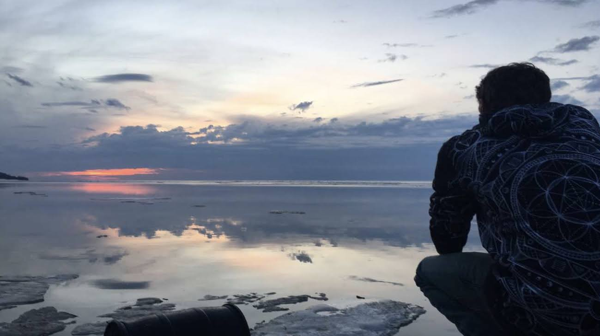
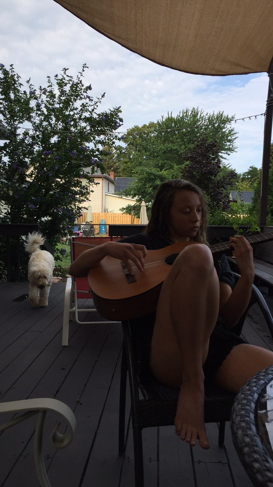
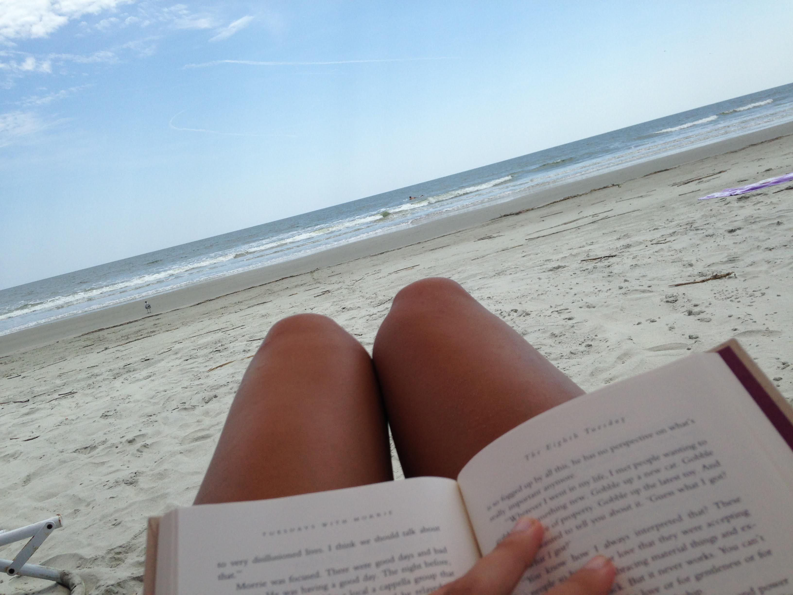
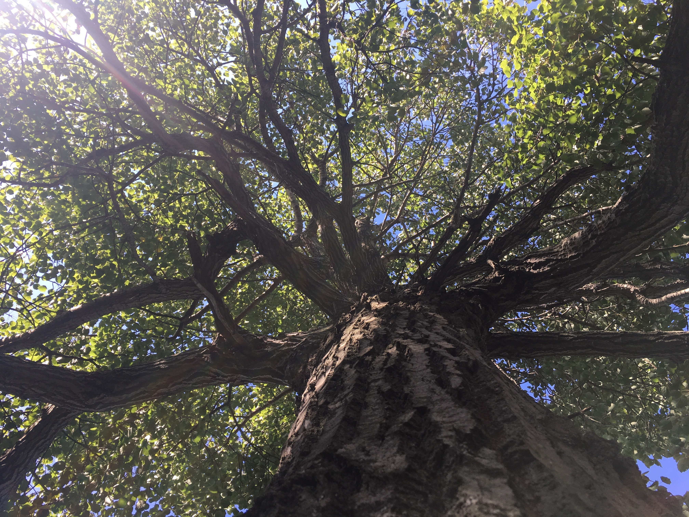

# Mia's Digital Git-Portfolio
### <i> Salutations! </i>  Welcome to the humble home page of my personal website.

**Navigate my silly little site:**

* [my Digital Projects page](portfolio.md)
* [my Resume](resume.md)
* [my Web Development Reflection/Comparison](reflection.md)
* [Corpus Analysis](corpusanalysis.md)

## A little about me:
I am currently a Digital Media, Arts, and Technology major at Penn State. Although I am relatively new to film production and photoshop software, capturing images and video and transforming them into art is one of my passions.

Recently, I have become familar with Adobe Premiere, oXygen.XML, GitHub, Hypothes.is, and general web development. Each day I strive to learn as much as humanly possible about these and other coding and digital art production software so that I may express my other passions through the ever-expanding and far-reaching digital medium someday.

Some of my other passions include protecting the environment, writing, film, Kurt Vonnegut, and music. Although I don’t have as much experience in current digital technologies as most students in my major, I’m an avid learner – I almost never pass up the opportunity to expand my knowledge.

One day, I hope to make contributions in some artistic or creative form to environmental organizations, or work for a media outlet that broadcasts informational/educational videos for the public, something like the Youtube channel TED-ED, or National Geographic.

<i> –Mia Borgia </i>

### Some photos that capture a little bit of what I'm all about:

 

*This is my child, his name is Mort*

 *This is my other child, her name is Bella*

*My favorite painting - Dream Caused by the flight of a Bee a second before Waking, Dali*

   *My hunny gazing at the sky in thin ice*

   
  
  *Me twiddlin on strings with Bella acting nonchalant*
 

   *Reading Mitch Albom in South Carolina*

   *A beautiful verdant glory I captured*
